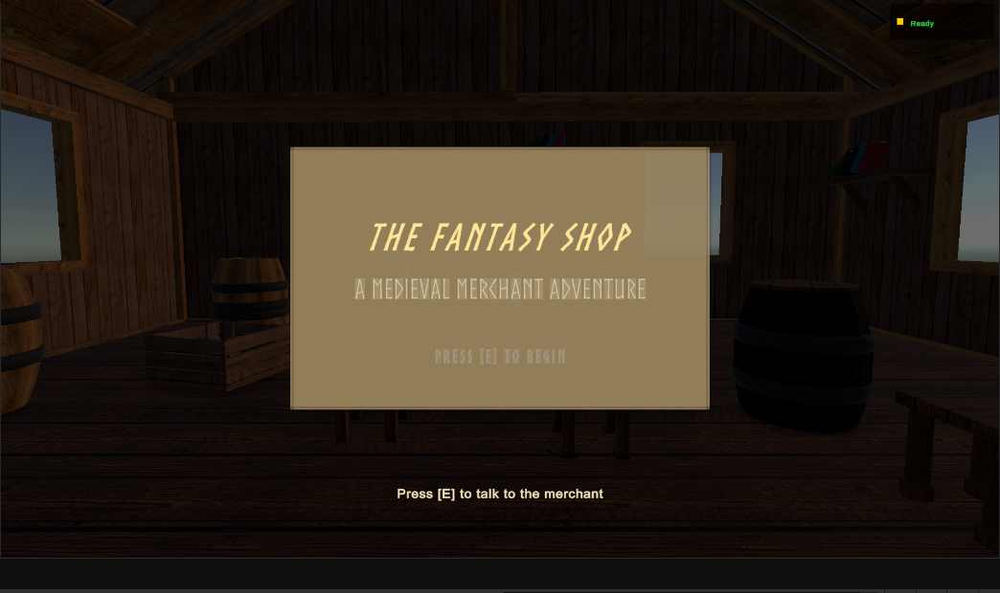
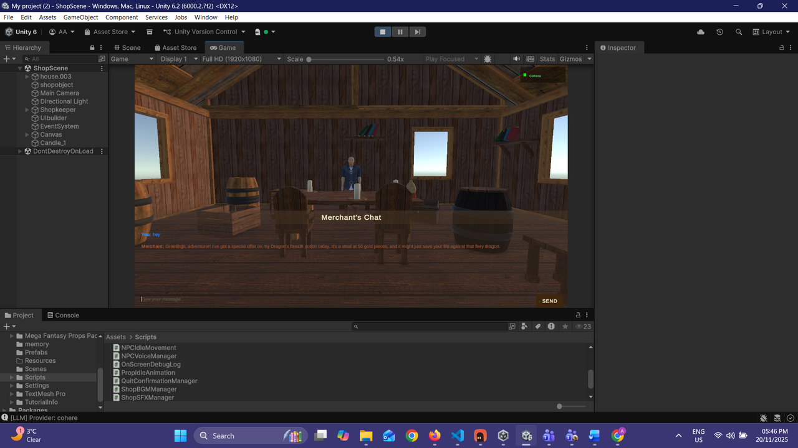
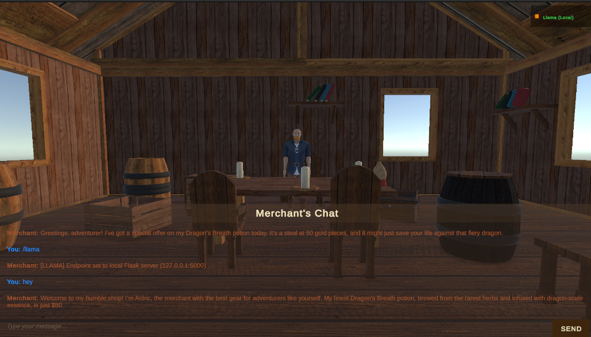
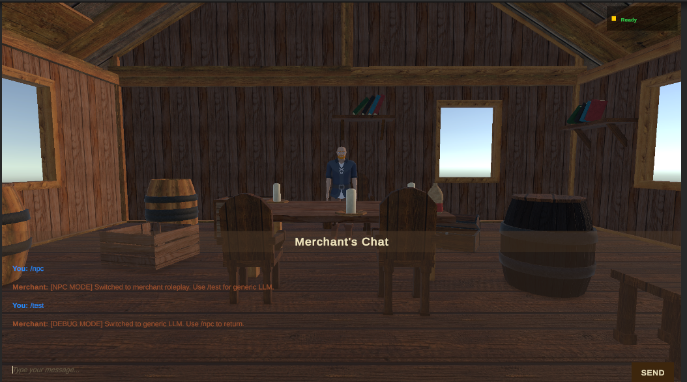
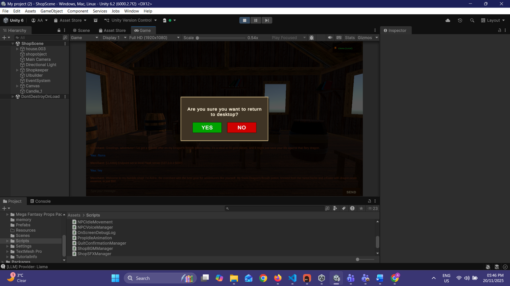
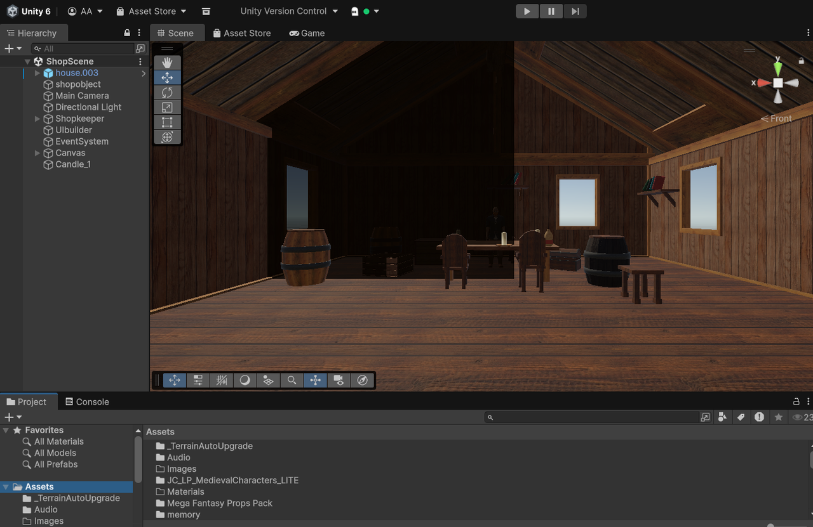

# Fantasy Shop — AI-Driven NPC Merchant

A real-time game system where an NPC merchant's dialogue and behaviour are driven by an external machine learning service.

## What it does
Connects a Unity game interface to an external ML service, with fallback logic so the NPC keeps behaving sensibly if the service is slow or unavailable.

## Tools
Unity (C#), Python

## Screenshots

| | |
|---|---|
|  |  |
|  |  |
|  |  |
|  | |

The NPC ("Aldric") responding via Cohere (cloud) vs. a locally hosted Llama model — both routed through the same chat UI with a live provider indicator (top right).

## Files
- [`AI_Merchant_Final_Report.docx`](AI_Merchant_Final_Report.docx) — the project report
- [`scripts/`](scripts) — the Unity C# scripts (`NPCController.cs`, `LLMAPIManager.cs`, `ChatManager.cs`, `ShopBGMManager.cs`, `ShopSFXManager.cs`, and others) — extracted from the full Unity project, which also depends on third-party asset packs not included here
- [`backend/`](backend) — the Flask backend (`flask_server.py` and an earlier iteration `og_flask_server.py`) that routes chat requests to Cohere/Ollama. **Note:** the original hardcoded API key has been redacted and replaced with `os.getenv("COHERE_API_KEY")` for this public repo — set it as an environment variable to run it yourself
- [`diagrams/`](diagrams) — architecture diagrams (`.drawio`, open at [app.diagrams.net](https://app.diagrams.net))
- [`gptgamemodel.ipynb`](gptgamemodel.ipynb) — an earlier prototype of the ML service side (Python)
- [`screenshots/`](screenshots) — see above

The NPC ("Aldric") is served through a Python Flask backend that routes chat requests to either Cohere (cloud, primary) or a locally hosted Llama model via Ollama (fallback), with runtime slash commands (`/llama`, `/cohere`, `/status`, `/npc`, `/test`) for switching providers and modes.

## Notes
Key challenges: Llama worked in the Unity editor but not in builds, due to networking differences — resolved with logging, certificate handling, and `link.xml` configuration. Provider switching was initially unstable because Flask responses overwrote Unity's preference values — fixed with a `preferred_provider` field in the JSON payload. NPC persona consistency was improved through prompt engineering and first-person voice rules.

Response time typically 2–5 seconds per message; the Cohere/Llama fallback logic kept the system available in the large majority of test sessions.
