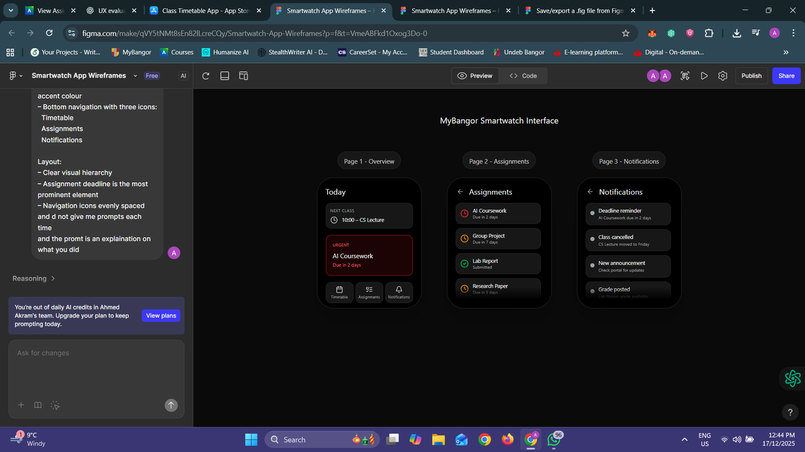

# Improved Computer Interface — UX Design

A UX design project applying a structured design process (research to prototype) to reduce cognitive load and improve interaction efficiency on a computer interface. Scenario: a smartwatch companion app for Bangor University's MyBangor student portal, surfacing timetable and deadline information at a glance.

## What it does
Walks through user research, design decisions, and a working prototype for an improved interface.

## Tools
Figma, Draw.io

## Images

## Files
- [`UI UX FInal Assignment.pdf`](UI%20UX%20FInal%20Assignment.pdf) — the full write-up: research, design decisions, and prototype
- [`images/`](images) — the Figma wireframes for the smartwatch companion app

## Notes
Applied Shneiderman's eight golden rules throughout — visibility of system status (haptic/visual feedback), consistency across screens, recognition over recall (surfacing deadlines rather than requiring lookup), reduced cognitive load per screen, user control via simple exit gestures, and error prevention by avoiding text entry and complex gestures on a small screen. Layout decisions used Gestalt principles of similarity (repeated list structures across screens) and proximity (whitespace grouping related content). Colour was used only for functional status (red/amber/green), reinforced with text labels rather than colour alone, for users with colour-vision deficiencies.

Next step would be usability testing with real students against the existing MyBangor portal, to validate whether the glance-based design actually reduces time-to-information versus the current site.
